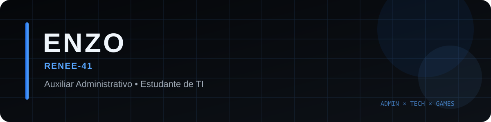
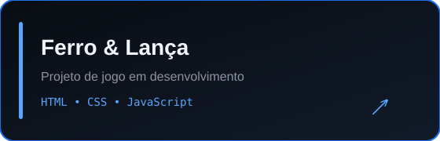
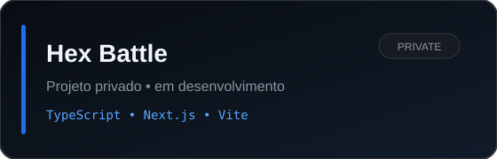
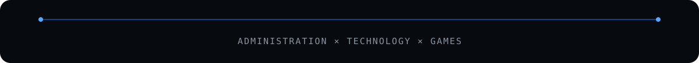

 

## Sobre mim

Sou **Enzo**, trabalho como **Auxiliar Administrativo** e estudo **TI na Fortec**.

Uso este espaço para acompanhar minha evolução na área de tecnologia e desenvolver projetos próprios, principalmente ligados a interfaces, web e jogos.

- Atualmente conciliando **rotina administrativa + tecnologia**
- Estudando e praticando desenvolvimento através de projetos
- Perfil: **@Renee-41**

## Tecnologias que uso e estudo

## Projetos

<table>
  <tr>
    <td width="50%" align="center">
      
    </td>
    <td width="50%" align="center">
      
    </td>
  </tr>
</table>

## GitHub

 

## Activity Graph

## GitHub Trophies

## Contributions

<picture>
  <source media="(prefers-color-scheme: dark)" srcset="https://raw.githubusercontent.com/Renee-41/Renee-41/output/github-contribution-grid-snake-dark.svg" />
  <source media="(prefers-color-scheme: light)" srcset="https://raw.githubusercontent.com/Renee-41/Renee-41/output/github-contribution-grid-snake.svg" />
  
</picture>

## Contato

 

